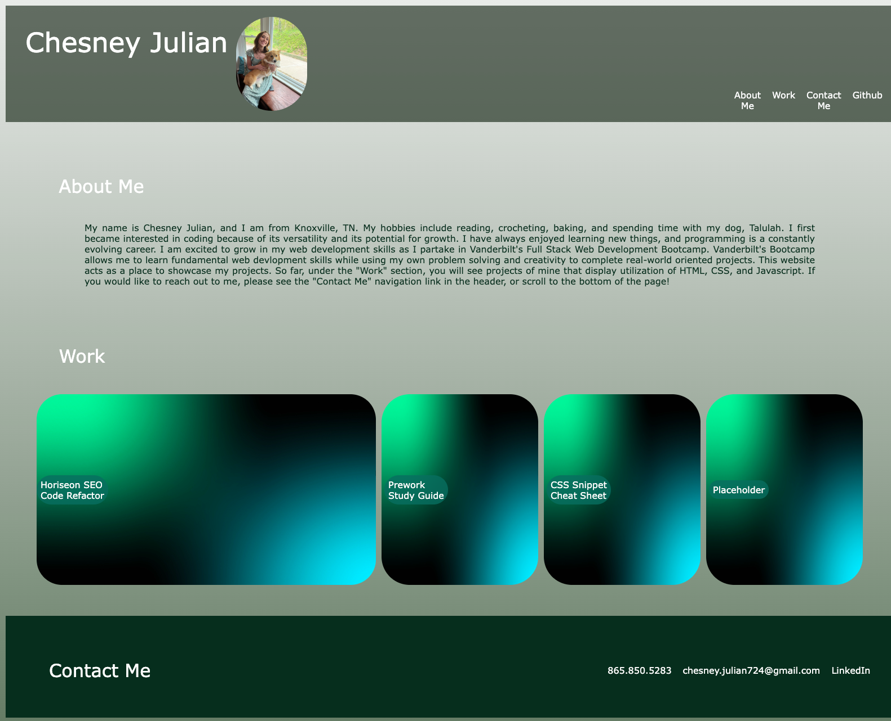

# personal-programming-portfolio

## Description

 This project's goal is to create a personalized webpage portfolio displaying a collection of deployed web development work samples. The target audience for this webpage will be future employers. Employers may use this page to learn more about me and view the content of my previous work. This webpage will contain:

- a header with my name, a photo of myself, and a nav bar that auto scrolls you to sections on the page
- an "About Me" section telling viewers information about myself and my coding experience
- a "Work" section containing image-links to deployed applications I wish to showcase along with the titles of each project
- a "Contact Me" section at the footer of the page with links to contact me through phone call, email, and LinkedIn
- media queries that allow the webpage to be viewed in formats specific to screens with max-widths of 992px and of 390px

## Deployed Application

### URL

[Chesney Julian Portfolio](https://chesneyjulian.github.io/personal-programming-portfolio/)

### Screenshot

## Usage

- Use the URL above to access the webpage
- Use the navigation bar at the top to automatically scroll  to sections within the page
- Use the tab to select links in succession on the page; when links in header and footer are selected, they will display a light green 
- When the image-links in the Work section are hovered over, they will expand in size above the other images; use these links to view my displayed work
- Use the links in the Contact Me section to directly call, email, or visit my LinkedIn and Github account 
- Adjust browser size, screen type, or use Chrome DevTools to view the webpage at different breakpoints

## Plans for the Future

- Replace final image placeholder with link to deployed application once more work has been added to my repository
- Give images in Work section a caption describing the basic skills displayed in each project
- Give avatar a hover action that allows the viewer to see a larger scaled version of the picture